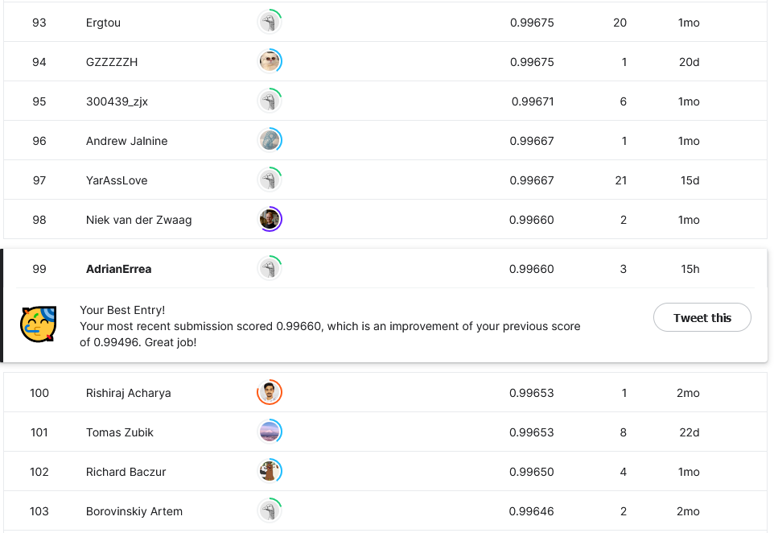

# MNIST_Kaggle

## Description
The main goal in this competition is to be able to identify correctly handwritten digits. This dataset is used as a basis for the benchmark of computer vision algorithms.

## Links

Home page: https://www.kaggle.com/competitions/digit-recognizer/

## Insights

The data provided is just a csv file with 784 columns corresponding to the pixels with a grey value between 0 and 255 and the label for that image.

+ As this data is originally tabular, I took my first approach on Tabular Data. I tried some Neural Networks and RandomForest to get a final model with 97% in my validation set which corresponds to a 97.1% on the test set. Notebooks: [Tabular_Data_Training.ipynb](https://github.com/adrianerrea/mnist_kaggle/blob/main/Tabular_Data_Training.ipynb) and [Tabular_Data_Inference.ipynb](https://github.com/adrianerrea/mnist_kaggle/blob/main/Tabular_Data_Inference.ipynb)

+ I changed the approach and I converted all the pixels into real images to be able to work with computer vision models.
I launched different arquitectures and my final model achieved a 99.6% over the validation set and a 99.6% in the test set as well. Notebooks: [Image_Data_Training.ipynb](https://github.com/adrianerrea/mnist_kaggle/blob/main/Image_Data_Training.ipynb) and [Image_Data_Inference.ipynb](https://github.com/adrianerrea/mnist_kaggle/blob/main/Image_Data_Inference.ipynb)
## Leaderboard

My final model got positioned in the TOP100 of the Leaderboard (at the time you are reading this). I got a final accuracy of 99.66% over the test set which is a really good result.
You can find out more about this controversial leaderboard and the 100% accuracy of the first positions, here: https://www.kaggle.com/competitions/digit-recognizer/discussion/183700

## Final Comments and Improvements

+ The computer vision models in this task are much more better than tabular models
+ This dataset has some mistakes in the labels and some of them are impossible to label with enough confidence
+ I tried SOTA models for my computer vision approach and they came up to be my best final model
+ As mentioned before, the leaderboard is not 100% reliable as many competitors are cheating the results
+ I could spend more time trying to get a little bit more accuracy but that would be less than 0.01%. Maybe not a big deal
